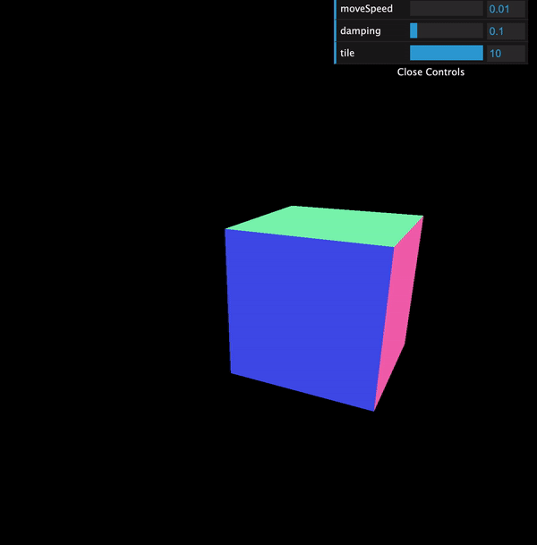

<h1 align="center">
Cube Transform | <a href="https://tomhsiao1260.github.io/cube-transform/" target="_blank">Play It<a/>
</h1>

<p align="center">
    
</p>

## Introduction

<h4 align="justify">
Try to add some damping features to the mesh transformation. Welcome to adjust the parameters through dat.GUI for further use in your own projects 🎉
<h4/>

<h4>
keywords： Three.js, Mesh Transformation, Damping Motion, Raycaster
<h4/>

## Installation

```
npm install
```

## Start Server

```
npm run dev
```

## Start Server

```
npm run dev
```

## Notes

<p>Would be really appreciated if you are willing to give me a star 🎉</p>
<p>If you have any questions or somewhere I can do better, welcome to send an issue or e-mail to me 🙏</p>

e-mail: tomtogo1260@gmail.com

